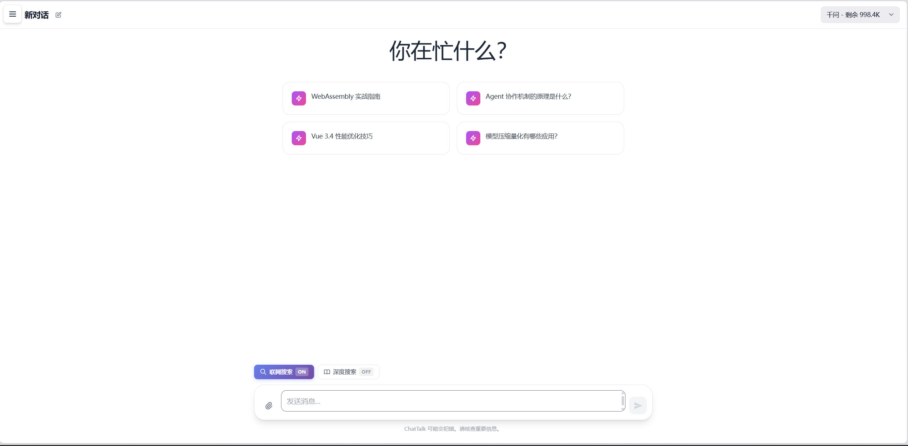
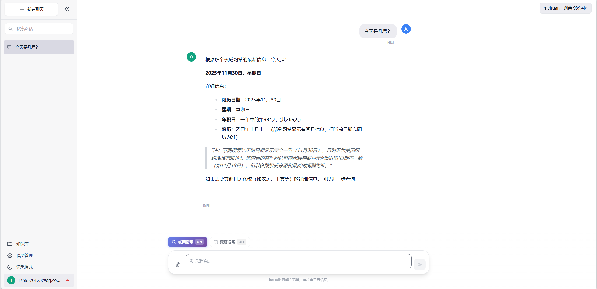
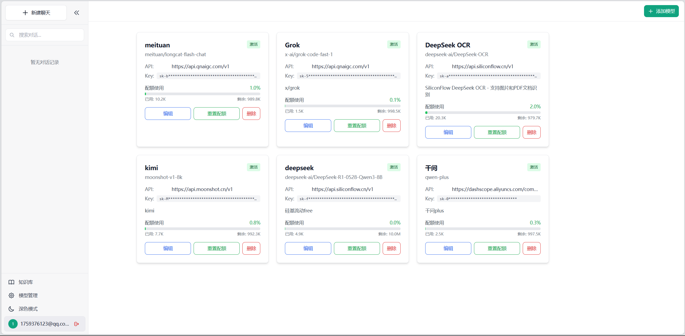

# 🤖 ChatTalk - 智能对话助手

<div align="center">


一个现代化的 AI 对话应用，采用 Vue 3 + FastAPI 构建，提供流畅的聊天体验。

[功能特性](#-功能特性) • [技术栈](#-技术栈) • [快速开始](#-快速开始) • [项目结构](#-项目结构) • [API 文档](#-api-文档)

</div>

---

## ✨ 功能特性

### 🎯 核心功能
- 💬 **流式对话** - 实时流式响应，体验流畅自然
- 🔄 **多模型支持** - 支持多个 AI 模型切换和管理
- 📝 **对话管理** - 完整的对话历史保存和管理
- 🎨 **智能推荐** - 基于场景的智能问题推荐
- 🌓 **深色模式** - 护眼深色模式，自动适配系统主题
- 🎤 **语音输入** - 浏览器原生语音识别，支持连续说话（Web Speech API）
- 📤 **消息导出** - 支持框选多条消息导出为 Markdown 或 PDF（模仿微信 PC 端）
- 📄 **OCR 识别** - 支持图片和 PDF 文件的文字识别
- 🖼️ **文件上传** - 拖拽上传图片和 PDF，智能识别并分析
- 🧠 **RAG 知识库** - 基于向量检索的知识库问答系统
- 🌐 **联网搜索** - 支持实时联网搜索获取最新信息

### 🔐 用户体验
- 👤 **用户认证** - JWT Token 安全认证
- 💾 **数据持久化** - 对话历史云端同步
- 📊 **配额管理** - 实时显示模型使用配额
- ⚡ **停止生成** - 随时中断 AI 输出
- 📱 **响应式设计** - 完美适配桌面和移动设备
- 🔄 **自动恢复** - 刷新后自动恢复上次对话和滚动位置
- 📸 **图片预览** - 点击放大查看上传的图片
- 📂 **文件管理** - 图片缩略图和 PDF 图标显示

### 🎨 界面设计
- 🖼️ **现代 UI** - 参考 ChatGPT 的精美界面设计
- 🎭 **侧边栏** - 可收起的对话列表侧边栏
- 🔍 **搜索过滤** - 快速查找历史对话
- ✏️ **标题编辑** - 点击即可编辑对话标题
- 🎨 **渐变卡片** - 精美的推荐问题卡片

---

## 🛠️ 技术栈

### 前端
- **框架**: Vue 3 (Composition API)
- **构建工具**: Vite 5
- **状态管理**: Pinia
- **路由**: Vue Router 4
- **样式**: TailwindCSS 3
- **HTTP 客户端**: Axios

### 后端
- **框架**: FastAPI 0.109
- **ORM**: SQLAlchemy 2.0
- **数据库**: SQLite / PostgreSQL
- **认证**: JWT (python-jose)
- **密码加密**: bcrypt
- **API 文档**: Swagger / ReDoc

### AI 集成
- 支持多种 AI 模型接入
- 流式响应 (Server-Sent Events)
- 自定义 API Key 和 Base URL
- 配额管理和统计
- OCR 文字识别 (SiliconFlow DeepSeek-OCR)
- 多模态支持（文本 + 图片）
- RAG 检索增强生成（向量数据库 + 语义搜索）
- 联网搜索集成（实时获取最新信息）
- 多种搜索模式（普通对话 / 知识库检索 / 联网搜索）

---

## 🚀 快速开始

### 环境要求

- **Node.js**: >= 16.0
- **Python**: >= 3.9
- **npm** 或 **yarn**

### 安装步骤

#### 1. 克隆项目

```bash
git clone https://github.com/lzl0323/chattalk.git
cd chattalk
```

#### 2. 后端设置

```bash
# 进入后端目录
cd backend

# 创建虚拟环境
python -m venv venv

# 激活虚拟环境 (Windows)
venv\Scripts\activate
# 激活虚拟环境 (Linux/Mac)
source venv/bin/activate

# 安装依赖
pip install -r requirements.txt

# 配置环境变量
cp .env.example .env
# 编辑 .env 文件，填入必要的配置

# 初始化数据库
python -m app.core.init_db

# 启动后端服务
uvicorn app.main:app --reload --host 0.0.0.0 --port 8000
```

#### 3. 前端设置

```bash
# 进入前端目录
cd frontend

# 安装依赖
npm install

# 启动开发服务器
npm run dev
```

#### 4. 访问应用

- **前端**: http://localhost:5173
- **后端 API**: http://localhost:8000
- **API 文档**: http://localhost:8000/docs

---

## 📁 项目结构

```
chattalk/
├── backend/                 # 后端服务
│   ├── app/
│   │   ├── api/            # API 路由
│   │   │   ├── auth.py     # 用户认证
│   │   │   ├── chat.py     # 对话接口
│   │   │   ├── conversations.py  # 对话管理
│   │   │   ├── model_configs.py  # 模型配置
│   │   │   ├── ocr.py      # OCR 识别
│   │   │   └── suggestions.py  # 智能推荐
│   │   ├── core/           # 核心配置
│   │   │   ├── config.py   # 配置管理
│   │   │   ├── database.py # 数据库连接
│   │   │   └── security.py # 安全认证
│   │   ├── models/         # 数据模型
│   │   │   ├── db_models.py  # 数据库模型
│   │   │   └── schemas.py    # API 模型
│   │   ├── services/       # 业务逻辑
│   │   │   ├── openai_service.py  # OpenAI 接口
│   │   │   ├── conversation_service.py
│   │   │   ├── ocr_service.py  # OCR 服务
│   │   │   └── suggestion_service.py
│   │   ├── uploads/        # 用户上传文件（不提交到 Git）
│   │   └── main.py         # 应用入口
│   ├── requirements.txt    # Python 依赖
│   └── .env.example        # 环境变量模板
│
├── frontend/               # 前端应用
│   ├── src/
│   │   ├── assets/        # 静态资源
│   │   ├── components/    # 组件
│   │   │   ├── chat/      # 聊天组件
│   │   │   │   ├── ChatMessage.vue  # 消息组件（支持图片/PDF）
│   │   │   │   ├── FileUpload.vue   # 文件上传组件
│   │   │   │   └── MessageInput.vue
│   │   │   └── layout/    # 布局组件
│   │   ├── router/        # 路由配置
│   │   ├── services/      # API 服务
│   │   ├── stores/        # 状态管理
│   │   │   ├── chatStore.js   # 对话状态（含滚动位置）
│   │   │   └── modelStore.js  # 模型状态
│   │   └── views/         # 页面视图
│   │       └── ChatView.new.vue  # 主聊天界面
│   ├── package.json       # Node 依赖
│   └── vite.config.js     # Vite 配置
│
├── docs/                  # 文档
├── .gitignore            # Git 忽略规则
└── README.md             # 项目说明
```

---

## 📡 API 文档

### 认证相关

#### 用户注册
```http
POST /api/auth/register
Content-Type: application/json

{
  "email": "user@example.com",
  "password": "password123"
}
```

#### 用户登录
```http
POST /api/auth/login
Content-Type: application/json

{
  "email": "user@example.com",
  "password": "password123"
}
```

### 对话相关

#### 获取对话列表
```http
GET /api/conversations
Authorization: Bearer {token}
```

#### 创建对话
```http
POST /api/conversations
Authorization: Bearer {token}
Content-Type: application/json

{
  "title": "新对话"
}
```

#### 流式聊天
```http
POST /api/chat
Authorization: Bearer {token}
Content-Type: application/json

{
  "message": "你好",
  "conversation_id": "xxx",
  "model_config_id": 1,
  "stream": true,
  "save_user_message": true
}
```

### OCR 识别

#### 上传并识别文件
```http
POST /api/ocr/upload
Authorization: Bearer {token}
Content-Type: multipart/form-data

file: [图片或PDF文件]
conversation_id: "xxx"
ocr_mode: "markdown"  # 可选: markdown, text, detailed
model_id: 1  # 可选，不提供则使用默认 OCR 模型
```

#### 获取 OCR 模型列表
```http
GET /api/ocr/models
Authorization: Bearer {token}
```

### 模型管理

#### 获取模型列表
```http
GET /api/models
Authorization: Bearer {token}
```

#### 添加模型
```http
POST /api/models
Authorization: Bearer {token}
Content-Type: application/json

{
  "name": "GPT-4",
  "model": "gpt-4",
  "api_base": "https://api.openai.com/v1",
  "api_key": "sk-xxx",
  "quota_limit": 1000000
}
```

---

## 🎨 功能截图

### 主聊天界面


简洁的欢迎界面，智能推荐卡片，流畅的对话体验，支持侧边栏对话历史管理。

### 对话详情


实时流式响应，支持文件上传和 OCR 识别，完整的对话历史记录。

### 模型管理


多模型配置界面，支持自定义 API，实时显示配额和状态。

---

## ⚙️ 环境配置

### 后端环境变量 (.env)

```env
# 数据库配置
DATABASE_URL=sqlite:///./chattalk.db

# JWT 配置
SECRET_KEY=your-secret-key-here
ALGORITHM=HS256
ACCESS_TOKEN_EXPIRE_MINUTES=10080

# CORS 配置
CORS_ORIGINS=http://localhost:5173,http://127.0.0.1:5173

# AI 服务配置（可选，也可在界面中配置）
DEFAULT_MODEL_NAME=gpt-3.5-turbo
DEFAULT_API_BASE=https://api.openai.com/v1
DEFAULT_API_KEY=sk-xxx

# OCR 服务配置
OCR_API_BASE=https://api.siliconflow.cn/v1
OCR_API_KEY=sk-xxx
OCR_MODEL=Pro/Qwen/Qwen2-VL-7B-Instruct
```

---

## 🔧 开发指南

### 前端开发

```bash
# 开发模式（热重载）
npm run dev

# 构建生产版本
npm run build

# 预览生产构建
npm run preview

# 代码检查
npm run lint
```

### 后端开发

```bash
# 运行开发服务器
uvicorn app.main:app --reload

# 数据库迁移
alembic revision --autogenerate -m "migration message"
alembic upgrade head

# 运行测试
pytest

# 代码格式化
black app/
```

---

## 📝 待办事项

### 已完成 ✅
- [x] 添加文件上传功能
- [x] 支持图片识别（OCR）
- [x] PDF 文件识别和显示
- [x] 对话滚动位置保存
- [x] RAG 知识库检索
- [x] 联网搜索功能
- [x] 多搜索模式切换
- [x] 修复 Pydantic v2 警告
- [x] 添加语音输入（Web Speech API）
- [x] 消息导出功能（支持框选导出为 Markdown/PDF）

### 进行中 🚧
- [ ] Docker 部署配置（配置文件已准备）
- [ ] 知识库管理界面优化

### 计划中 📅
- [ ] 多语言支持
- [ ] 单元测试覆盖
- [ ] CI/CD 集成
- [ ] 支持更多文件格式（Word、Excel 等）
- [ ] 图片编辑和标注功能
- [ ] 插件系统

---

## 🤝 贡献

欢迎提交 Issue 和 Pull Request！

1. Fork 本仓库
2. 创建特性分支 (`git checkout -b feature/AmazingFeature`)
3. 提交更改 (`git commit -m 'Add some AmazingFeature'`)
4. 推送到分支 (`git push origin feature/AmazingFeature`)
5. 开启 Pull Request

---

## 📄 开源协议

本项目采用 [MIT](LICENSE) 协议开源。

---

## 👨‍💻 作者

**lzl0323**

- GitHub: [@lzl0323](https://github.com/lzl0323)

---

## 🙏 致谢

- [Vue.js](https://vuejs.org/) - 渐进式 JavaScript 框架
- [FastAPI](https://fastapi.tiangolo.com/) - 现代高性能 Python Web 框架
- [TailwindCSS](https://tailwindcss.com/) - 实用优先的 CSS 框架
- [OpenAI](https://openai.com/) - AI 技术支持

---

<div align="center">

**⭐ 如果这个项目对你有帮助，请给个 Star ⭐**

Made with ❤️ by lzl0323

</div>
